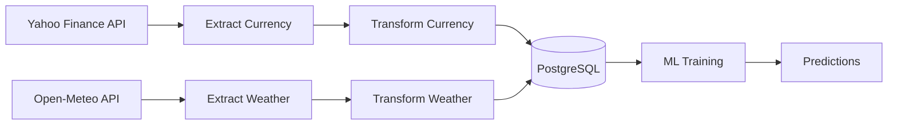

# 🌐 End-to-End Data Engineering: Currency & Weather Prediction Pipeline

<div align="center">


**Pipeline Data Engineering End-to-End untuk Prediksi Nilai Tukar Mata Uang USD/ISK Berdasarkan Data Cuaca**

[Tentang](#-tentang-proyek) •
[Arsitektur](#-arsitektur) •
[Teknologi](#-teknologi-yang-digunakan) •
[Instalasi](#-instalasi) •
[Penggunaan](#-penggunaan) •
[Struktur Proyek](#-struktur-proyek)

</div>

---

## 📚 Dokumentasi & Demo

| Resource | Link |
|----------|------|
| 📝 **Dokumen Project (Blog Post)** | [Notion - Prediksi Nilai Tukar ISK terhadap USD](https://secretive-citipati-39d.notion.site/Prediksi-Nilai-Tukar-ISK-terhadap-USD-Berdasarkan-Data-Cuaca-Ekstrem-di-Islandia-1440731850318096be61c2852a2bbd11) |
| 🎬 **Video Presentasi + Demo** | [YouTube](https://youtu.be/iAL77PBYi8U) |

---

## 📖 Tentang Proyek

Proyek ini merupakan implementasi **End-to-End Data Engineering Pipeline** yang menggabungkan pengumpulan data, transformasi, penyimpanan, dan pemodelan machine learning.  Pipeline ini mengekstrak data nilai tukar mata uang **USD/ISK (Dollar AS ke Krona Islandia)** dan data cuaca Islandia, kemudian menggunakan data tersebut untuk membangun model prediksi.

### 🎯 Tujuan Utama
- Membangun pipeline ETL (Extract, Transform, Load) yang terotomatisasi
- Mengintegrasikan multiple data sources (Yahoo Finance API & Open-Meteo API)
- Menerapkan praktik Data Engineering terbaik dengan containerization
- Membangun model Machine Learning untuk prediksi nilai tukar

---

## 🏗 Arsitektur

```
┌─────────────────────────────────────────────────────────────────────────────┐
│                           DATA PIPELINE ARCHITECTURE                         │
├─────────────────────────────────────────────────────────────────────────────┤
│                                                                              │
│   ┌──────────────┐     ┌──────────────┐     ┌──────────────────────────┐    │
│   │ Yahoo Finance│     │  Open-Meteo  │     │      Data Sources        │    │
│   │     API      │     │     API      │     │                          │    │
│   └──────┬───────┘     └──────┬───────┘     └──────────────────────────┘    │
│          │                    │                                              │
│          │     EXTRACT        │                                              │
│          └────────┬───────────┘                                              │
│                   ▼                                                          │
│   ┌───────────────────────────────────────────────────────────────────┐     │
│   │                     Apache Airflow DAG                             │     │
│   │  ┌─────────────────────────────────────────────────────────────┐  │     │
│   │  │                      TRANSFORM                               │  │     │
│   │  │  • Data Cleaning    • Outlier Handling                      │  │     │
│   │  │  • Column Mapping   • Data Validation                       │  │     │
│   │  └─────────────────────────────────────────────────────────────┘  │     │
│   └───────────────────────────────────────────────────────────────────┘     │
│                   │                                                          │
│                   ▼         LOAD                                            │
│   ┌───────────────────────────────────────────────────────────────────┐     │
│   │                      PostgreSQL Database                          │     │
│   │  ┌─────────────────┐    ┌─────────────────┐                      │     │
│   │  │  currency_data  │    │  weather_data   │                      │     │
│   │  └─────────────────┘    └─────────────────┘                      │     │
│   └───────────────────────────────────────────────────────────────────┘     │
│                   │                                                          │
│                   ▼         ML MODELING                                     │
│   ┌───────────────────────────────────────────────────────────────────┐     │
│   │                    Machine Learning Models                        │     │
│   │  • Linear Regression  • XGBoost                                  │     │
│   │  • Random Forest      • Decision Tree                            │     │
│   └───────────────────────────────────────────────────────────────────┘     │
│                                                                              │
└─────────────────────────────────────────────────────────────────────────────┘
```

---

## 🛠 Teknologi yang Digunakan

| Kategori | Teknologi |
|----------|-----------|
| **Orchestration** | Apache Airflow 2.7.1 |
| **Database** | PostgreSQL 13, Supabase |
| **Containerization** | Docker, Docker Compose |
| **Programming** | Python 3.x |
| **Data Processing** | Pandas, NumPy |
| **Machine Learning** | Scikit-learn, XGBoost |
| **Data Visualization** | Matplotlib, Seaborn |
| **API Sources** | Yahoo Finance (yfinance), Open-Meteo |

---

## 📥 Instalasi

### Prasyarat
- Docker & Docker Compose
- Python 3.8+
- Git

### Langkah Instalasi

1. **Clone Repository**
   ```bash
   git clone https://github.com/farreladriann/endToEndDataEngineering.git
   cd endToEndDataEngineering
   ```

2. **Setup Environment**
   ```bash
   chmod +x setup.sh
   ./setup.sh
   ```

3. **Jalankan Docker Containers**
   ```bash
   docker-compose up -d
   ```

4. **Akses Airflow Web UI**
   ```
   URL: http://localhost:8080
   Username: admin
   Password: admin
   ```

---

## 🚀 Penggunaan

### Menjalankan Pipeline

```bash
# Menggunakan script management
./manage.sh start    # Menjalankan semua services
./manage.sh stop     # Menghentikan semua services
./manage.sh restart  # Restart services
```

### Komponen Pipeline

#### 1️⃣ Extract (Pengambilan Data)
- **Currency Data**:  Mengambil data USD/ISK dari Yahoo Finance
- **Weather Data**: Mengambil data cuaca Islandia dari Open-Meteo API

#### 2️⃣ Transform (Transformasi Data)
- Pembersihan data dan handling missing values
- Penghapusan outlier menggunakan metode IQR
- Normalisasi dan standardisasi data

#### 3️⃣ Load (Penyimpanan Data)
- Menyimpan data ke PostgreSQL dengan upsert mechanism
- Indexing untuk optimasi query

#### 4️⃣ Machine Learning
Model yang diimplementasikan:
- **Linear Regression** - Model baseline
- **XGBoost** - Gradient boosting ensemble
- **Random Forest** - Bagging ensemble
- **Decision Tree** - Tree-based model

---

## 📁 Struktur Proyek

```
endToEndDataEngineering/
├── 📂 airflow/
│   ├── 📂 dags/
│   │   └── currency_weather_pipeline.py  # Main ETL DAG
│   ├── 📂 config/
│   └── 📂 logs/
├── 📂 docker/
│   ├── 📂 airflow/
│   │   └── Dockerfile
│   ├── 📂 jupyter/
│   │   └── Dockerfile
│   └── 📂 postgres/
│       └── init.sql
├── 📂 src/
│   ├── 📂 data/
│   │   ├── currency.py               # Currency data handler
│   │   └── weather.py                # Weather data handler
│   ├── 📂 database/
│   │   └── connection.py             # Database connections
│   ├── 📂 models/
│   │   ├── preprocessing.py          # Data preprocessing
│   │   └── train.py                  # Model training
│   └── 📂 utils/
│       └── logger.py                 # Logging utilities
├── 📂 notebooks/
│   ├── KODING_FULL.ipynb             # Full exploration notebook
│   └── modelling.ipynb               # ML modeling notebook
├── 📂 tests/
├── 📂 data/
├── 📄 docker-compose.yml
├── 📄 requirements.txt
├── 📄 setup.sh
├── 📄 manage.sh
└── 📄 README.md
```

---

## 📊 Data Flow



---

## 🔑 Fitur Utama

| Fitur | Deskripsi |
|-------|-----------|
| ⚡ **Automated ETL** | Pipeline ETL terjadwal harian dengan Apache Airflow |
| 🐳 **Containerized** | Fully containerized dengan Docker untuk reproducibility |
| 📈 **ML Integration** | Multiple ML models dengan auto-selection based on RMSE |
| 🔄 **Upsert Mechanism** | Data update tanpa duplikasi dengan ON CONFLICT clause |
| 📝 **Logging** | Comprehensive logging untuk monitoring dan debugging |
| 🧪 **Testing** | Unit tests untuk memastikan kualitas kode |

---

## 📈 Model Performance

Model diseleksi berdasarkan **RMSE (Root Mean Square Error)** terendah:

| Model | Metrics |
|-------|---------|
| Linear Regression | Baseline model |
| XGBoost | Gradient boosting |
| Random Forest | Ensemble learning |
| Decision Tree | Tree-based |

Best model disimpan secara otomatis ke direktori `/models/`.

---

<div align="center">

**⭐ Star this repository if you find it helpful!  ⭐**

Made with ❤️ by Farrel Adrian

</div>
